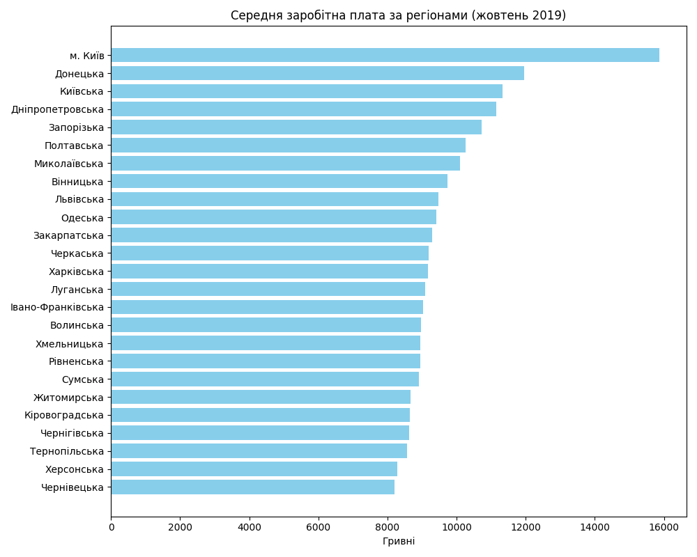

# Звіт про виконання лабораторної роботи
**Тема:** Використання системи контролю версій Git у проєктах аналізу даних

## 1. Опис проєкту та даних
У роботі досліджено результати моніторингу номінальної заробітної плати в Україні за жовтень 2019 року. 
- **Джерело:** [data.gov.ua](https://data.gov.ua/dataset/412a6bfc-3ff9-4ba8-a35a-4a57166e6185).
- **Обробка:** Дані були вилучені зі складного Excel-файлу, очищені від артефактів форматування та перетворені на структуровані CSV-таблиці.

## 2. Відповіді на гіпотези
1. **Найбільший приріст номінальної ЗП:** Лідером стала галузь "Фінансова та страхова діяльність".
2. **Виробництво vs Послуги:** Сфера послуг (за рахунок фінансів та IT) демонструє вищий рівень середньої оплати праці порівняно з промисловим сектором.
3. **Регіональні лідери та аутсайдери:**
   - Найвища середня ЗП: **м. Київ** (15 862 грн).
   - Найнижча середня ЗП: **Чернівецька та Херсонська області** (~8 211 - 8 277 грн).

## 3. Візуалізація результатів
На графіку нижче зображено розподіл заробітних плат за регіонами:



## 4. Результати роботи з Git
Під час виконання роботи було:
- Опановано **Feature Branch Workflow**.
- Розв'язано **merge conflict** у файлі `README.md`.
- Виправлено історію комітів (авторство та імейли) за допомогою `rebase`.
- Проведено злиття гілок через **Pull Requests** на GitHub.

## 5. Історія комітів (git log)
```bash
# git log --oneline --graph --decorate --all
* 33c7dac (HEAD -> main, tag: v0.1.0, origin/main) chore: add CHANGELOG and prepare for v0.1.0
* a8bdad2 feat: add visualization module and regional wage chart (#8)
| * 2358c11 (origin/feature/visualization, feature/visualization) feat: add visualization module and regional wage chart
|/  
* cad9741 docs: add research findings summary to README (#7)
* 30cec49 docs: add quality analysis summary to README (#6)
| * a1a535d (origin/conflict-research, conflict-research) docs: add research findings summary to README
|/  
| * 7a92a09 (origin/conflict-quality, conflict-quality) docs: add quality analysis summary to README
|/  
* 3c71bd9 feat: implement statistical research to validate economic hypotheses (#5)
* 9496cbc feat: implement data validation to detect structural anomalies in minimum wage (#4)
| * 109b894 (origin/feature/data_research, feature/data_research) feat: implement statistical research to validate economic hypotheses
|/  
| * 01f154e (origin/feature/data_quality_analysis, feature/data_quality_analysis) feat: implement data validation to detect structural anomalies in minimum wage
|/  
* ac1f628 feat: add data preprocessing module to extract clean tables from excel (#3)
| * a66a24c (origin/feature/data_preprocessing, feature/data_preprocessing) feat: add data preprocessing module to extract clean tables from excel
|/  
* b1fa4dd Feature/data load (#2)
| * afa2ccf (origin/feature/data-load, feature/data-load) style: add newlines at the end of the files
| * 6a3fecb feat: add data loading script and project dependencies
|/  
* b613af4 docs: define project goals and hypotheses for wage analysis
* 40a9192 chore: initial project structure and gitignore
```